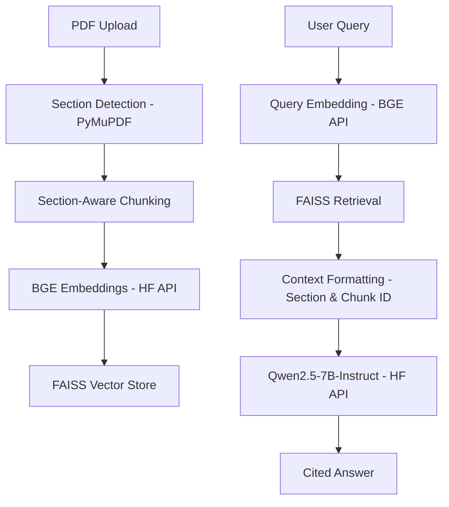

# Section-Aware PDF RAG Assistant 📄🕵️‍♂️

A production-ready, section-aware Retrieval-Augmented Generation (RAG) system built with **Qwen2.5-7B-Instruct**, **BGE Embeddings**, and **FAISS**. This assistant is designed to provide cited, grounded answers from research papers and technical documents while respecting the document's structure.

## 🚀 Features

- **Section-Aware Ingestion**: Automatically detects document sections (e.g., Introduction, Methodology, Results) using PyMuPDF.
- **Strict Grounding**: Uses a custom system prompt that forces the model to use ONLY provided context and provide exact citations.
- **Memory Efficient**: Offloads heavy model inference (Generation & Embeddings) to the **Hugging Face Inference API**, making it runnable on systems with as little as 8GB RAM.
- **Fast Retrieval**: Uses **FAISS** (CPU) for high-performance localized similarity search.
- **Modern UI**: Clean **Streamlit** interface for easy PDF uploading and interactive Q&A.

## 🛠️ Architecture



## ⚙️ Setup

### 1. Prerequisites
- Python 3.10+
- [uv](https://github.com/astral-sh/uv) package manager
- [Hugging Face Access Token](https://huggingface.co/settings/tokens)

### 2. Installation
Clone the repository and install dependencies using `uv`:

```bash
uv sync
```

### 3. Configuration
Create a `.env` file in the root directory:

```env
HF_TOKEN="your_huggingface_token_here"
HUGGINGFACE_API_KEY="your_huggingface_token_here"
```

## 📖 Usage

### Running the Web App
Launch the Streamlit interface:

```bash
uv run streamlit run app/streamlit_app.py
```

### Running Tests
To verify the retrieval pipeline:

```bash
# Windows
$env:PYTHONPATH="."
uv run python tests/test_retriever_faiss.py

# Linux/macOS
PYTHONPATH=. uv run python tests/test_retriever_faiss.py
```

## 📝 Document Handling
The system uses a heuristic-based header detection to identify sections. For best results, use PDFs with clear heading hierarchical structures (standard research papers work best).

### Citation Format
The model provides answers with explicit citations:
`(Section: Methodology, Chunk: 2)`

